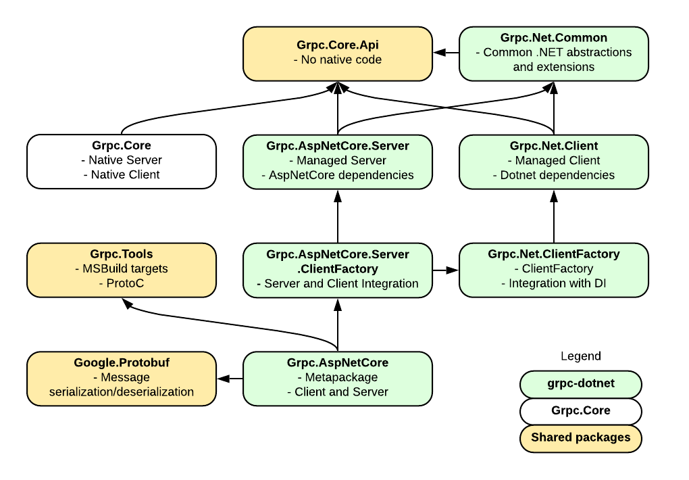

# gRPC ASP.NET Core packages

## Overview

## Design considerations

### Grpc.AspNetCore

We envision shipping both a managed client and managed server. Since gRPC services often act as both client and server, we want to make the consumption of both components as frictionless as possible. In addition to the server and client packages, the metapackage will also take dependencies on tooling support (code gen from Grpc.Tools and ServiceReference support from Microsoft.Extensions.ApiDescription.Design) and the default message protocol (Google.Protobuf).

We want to distinguish these from the native clients and server so the package names will be prefixed with Grpc.AspNetCore/Grpc.NetCore. We don't expect most users to take a direct dependency on these packages so we will use a three-part name.

We are committed to delivering the managed server experience Microsoft.AspNetCore.Server functionalities in ASP.NET Core 3.0 timeframe. We will strive to also deliver the mananged client experience in 3.0.

### Namespaces

Types in the Grpc.Core.Api pacakge will use the same namespaces of their original types in Grpc.Core to retain full API back-compatibility. Type forwarding from Grpc.Core to Grpc.Core.Api will also be used to ensure ABI back-compatibility.

Public Types in the Grpc.AspNetCore.Server will be included in the Grpc.AspNetCore.Server namespace with exceptions for certain APIs which by convention uses other namespaces (for example, ServiceExtensions belong to the Microsoft.Extensions.DependencyInjection namespace).

By convention, internal types will be included in the {PackageName}.Internal namespace.

### Grpc.Core.Api

To implement the managed server, we need to have access to the APIs in Grpc.Core. However, the ASP.NET Core implementation aims to be purely managed with no native dependencies. This will require the extractions of APIs from Grpc.Core to Grpc.Core.Api. The full list of types we aim to include in Grpc.Core.Api is as follows:

Type | Include in Grpc.Core.Api | Justification
-- | -- | --
Grpc.Core.AsyncAuthInterceptor | N | Asp.Net Core uses middlewares
Grpc.Core.AsyncClientStreamingCall`2 | N | No client
Grpc.Core.AsyncDuplexStreamingCall`2 | N | No client
Grpc.Core.AsyncServerStreamingCall`1 | N | No client
Grpc.Core.AsyncUnaryCall`1 | N | No client
Grpc.Core.AuthContext | Y | Required for implementation, implementation may need to be changed
Grpc.Core.AuthInterceptorContext | N | Asp.Net Core uses middlewares
Grpc.Core.AuthProperty | Y | Required for implementation, implementation may need to be changed
Grpc.Core.CallCredentials | N | No client
Grpc.Core.CallInvocationDetails`2 | N | No client
Grpc.Core.CallInvoker | N | No client
Grpc.Core.CallOptions | N | No client
Grpc.Core.Calls | N | No client
Grpc.Core.Channel | N | No client
Grpc.Core.ChannelCredentials | N | No client
Grpc.Core.ChannelCredentials+InsecureCredentialsImpl | N | No client
Grpc.Core.ChannelOption | N | No client
Grpc.Core.ChannelOption+OptionType | N | No client
Grpc.Core.ChannelOptions | N | No client
Grpc.Core.ChannelState | N | No client
Grpc.Core.ClientBase | N | No client
Grpc.Core.ClientBase`1 | N | No client
Grpc.Core.ClientBase+ClientBaseConfiguration | N | No client
Grpc.Core.ClientBase+ClientBaseConfiguration+ClientBaseConfigurationInfo | N | No client
Grpc.Core.ClientBase+ClientBaseConfiguration+ClientBaseConfigurationInterceptor | N | No client
Grpc.Core.ClientStreamingServerMethod`2 | Y | Required for implementation
Grpc.Core.CompositeCallCredentials | N | No client
Grpc.Core.CompositeChannelCredentials | N | No client
Grpc.Core.CompressionLevel | N | Not used, not anticipated to be used in any implementaion,   Microsoft.AspNetCore.ResponseCompression?
Grpc.Core.ContextPropagationFlags | Y | Required for implementation, implementation may need to be changed
Grpc.Core.ContextPropagationOptions | Y | Required for implementation, implementation may need to be changed
Grpc.Core.ContextPropagationToken | Y | Required for implementation, implementation may need to be changed
Grpc.Core.DefaultCallInvoker | N | No client
Grpc.Core.DeserializationContext | Y | Transitive requirement
Grpc.Core.DuplexStreamingServerMethod`2 | Y | Required for implementation
Grpc.Core.GrpcEnvironment | N | Not used, lifetimes , logging, threadding, are handled differently
Grpc.Core.GrpcEnvironment+ShutdownHooks | N | Not used, lifetimes , logging, threadding, are handled differently
Grpc.Core.IAsyncStreamReader`1 | Y | Required for implementation
Grpc.Core.IAsyncStreamWriter`1 | Y | Required for implementation
Grpc.Core.IClientStreamWriter`1 | N | No client
Grpc.Core.IHasWriteOptions | Y | Transitive requirement
Grpc.Core.IMethod | Y | Transitive requirement
Grpc.Core.Interceptors.CallInvokerExtensions | N | Not used, Asp.Net Core uses middlewares
Grpc.Core.Interceptors.CallInvokerExtensions+MetadataInterceptor | N | Not used, Asp.Net Core uses middlewares
Grpc.Core.Interceptors.ChannelExtensions | N | Not used, Asp.Net Core uses middlewares
Grpc.Core.Interceptors.ClientInterceptorContext`2 | N | Not used, Asp.Net Core uses middlewares
Grpc.Core.Interceptors.InterceptingCallInvoker | N | Not used, Asp.Net Core uses middlewares
Grpc.Core.Interceptors.Interceptor | N | Not used, Asp.Net Core uses middlewares
Grpc.Core.Interceptors.Interceptor+AsyncClientStreamingCallContinuation`2 | N | Not used, Asp.Net Core uses middlewares
Grpc.Core.Interceptors.Interceptor+AsyncDuplexStreamingCallContinuation`2 | N | Not used, Asp.Net Core uses middlewares
Grpc.Core.Interceptors.Interceptor+AsyncServerStreamingCallContinuation`2 | N | Not used, Asp.Net Core uses middlewares
Grpc.Core.Interceptors.Interceptor+AsyncUnaryCallContinuation`2 | N | Not used, Asp.Net Core uses middlewares
Grpc.Core.Interceptors.Interceptor+BlockingUnaryCallContinuation`2 | N | Not used, Asp.Net Core uses middlewares
Grpc.Core.Interceptors.ServerServiceDefinitionExtensions | N | Not used, Asp.Net Core uses middlewares
Grpc.Core.Internal.AsyncCall`2 | N | No client
Grpc.Core.Internal.AsyncCallBase`2 | N | No client
Grpc.Core.Internal.AsyncCallServer`2 | N | Not used, implementation different
Grpc.Core.Internal.AsyncCallServer`2+ResponseWithFlags | N | Not used, implementation different
Grpc.Core.Internal.AtomicCounter | N | Not used, not anticipated to be used in any implementaion
Grpc.Core.Internal.AuthContextSafeHandle | N | No native
Grpc.Core.Internal.AuthContextSafeHandle+NativeAuthProperty | N | No native
Grpc.Core.Internal.AuthContextSafeHandle+NativeAuthPropertyIterator | N | No native
Grpc.Core.Internal.BatchCompletionDelegate | N | No native
Grpc.Core.Internal.BatchContextSafeHandle | N | No native
Grpc.Core.Internal.BatchContextSafeHandle+CompletionCallbackData | N | No native
Grpc.Core.Internal.CallCredentialsSafeHandle | N | No client, No native
Grpc.Core.Internal.CallError | N | No native
Grpc.Core.Internal.CallErrorExtensions | N | No native
Grpc.Core.Internal.CallFlags | N | No client
Grpc.Core.Internal.CallSafeHandle | N | No native
Grpc.Core.Internal.ChannelArgsSafeHandle | N | No client, No native, No C-Core Server
Grpc.Core.Internal.ChannelCredentialsSafeHandle | N | No client, No native
Grpc.Core.Internal.ChannelSafeHandle | N | No client, No native
Grpc.Core.Internal.ClientRequestStream`2 | N | No client
Grpc.Core.Internal.ClientResponseStream`2 | N | No client
Grpc.Core.Internal.ClientSideStatus | N | No client
Grpc.Core.Internal.ClientStreamingServerCallHandler`2 | N | Implementation different
Grpc.Core.Internal.ClockType | N | Not used, not anticipated to be used in any implementaion
Grpc.Core.Internal.CompletionQueueEvent | N | Not used, No native
Grpc.Core.Internal.CompletionQueueEvent+CompletionType | N | Not used, No native
Grpc.Core.Internal.CompletionQueueSafeHandle | N | Not used, No native
Grpc.Core.Internal.CompletionQueueSafeHandle+UsageScope | N | Not used, No native
Grpc.Core.Internal.CompletionRegistry | N | Not used, No native
Grpc.Core.Internal.CompletionRegistry+IntPtrComparer | N | Not used, No native
Grpc.Core.Internal.CStringSafeHandle | N | Not used, No native
Grpc.Core.Internal.DebugStats | N | Not used, not anticipated to be used in any implementaion
Grpc.Core.Internal.DefaultDeserializationContext | N | No client
Grpc.Core.Internal.DefaultObjectPool`1 | N | Not used, Microsoft.Extensions.ObjectPool
Grpc.Core.Internal.DefaultObjectPool`1+ThreadLocalData | N | Not used, Microsoft.Extensions.ObjectPool
Grpc.Core.Internal.DefaultSerializationContext | N | No client
Grpc.Core.Internal.DefaultSslRootsOverride | N | No native
Grpc.Core.Internal.DuplexStreamingServerCallHandler`2 | N | Implementation different
Grpc.Core.Internal.GprLogDelegate | N | No native
Grpc.Core.Internal.GrpcThreadPool | N | Not used, No native
Grpc.Core.Internal.HandlerUtils | N | Implementation different
Grpc.Core.Internal.INativeCall | N | No native
Grpc.Core.Internal.IObjectPool`1 | N | Not used, Microsoft.Extensions.ObjectPool
Grpc.Core.Internal.IOpCompletionCallback | N | Not used, No native
Grpc.Core.Internal.IPooledObject`1 | N | Not used, Microsoft.Extensions.ObjectPool
Grpc.Core.Internal.IReceivedCloseOnServerCallback | N | Not used, implementation different
Grpc.Core.Internal.IReceivedMessageCallback | N | Not used, implementation different
Grpc.Core.Internal.IReceivedResponseHeadersCallback | N | Not used, implementation different
Grpc.Core.Internal.IReceivedStatusOnClientCallback | N | Not used, implementation different
Grpc.Core.Internal.ISendCompletionCallback | N | Not used, implementation different
Grpc.Core.Internal.ISendStatusFromServerCompletionCallback | N | Not used, implementation different
Grpc.Core.Internal.IServerCallHandler | Y | Implementation different
Grpc.Core.Internal.IUnaryResponseClientCallback | N | Not used, implementation different
Grpc.Core.Internal.MarshalUtils | Y | Transitive requirement
Grpc.Core.Internal.MetadataArraySafeHandle | N | No native
Grpc.Core.Internal.MonoPInvokeCallbackAttribute | N | No native
Grpc.Core.Internal.NativeCallbackTestDelegate | N | No native
Grpc.Core.Internal.NativeExtension | N | No native
Grpc.Core.Internal.NativeLogRedirector | N | No native
Grpc.Core.Internal.NativeMetadataCredentialsPlugin | N | No native
Grpc.Core.Internal.NativeMetadataInterceptor | N | No native
Grpc.Core.Internal.NativeMethods | N | No native
Grpc.Core.Internal.NativeMethods+Delegates | N | No native
Grpc.Core.Internal.NativeMethods+Delegates+gprsharp_convert_clock_type_delegate | N | No native
Grpc.Core.Internal.NativeMethods+Delegates+gprsharp_free_delegate | N | No native
Grpc.Core.Internal.NativeMethods+Delegates+gprsharp_inf_future_delegate | N | No native
Grpc.Core.Internal.NativeMethods+Delegates+gprsharp_inf_past_delegate | N | No native
Grpc.Core.Internal.NativeMethods+Delegates+gprsharp_now_delegate | N | No native
Grpc.Core.Internal.NativeMethods+Delegates+gprsharp_sizeof_timespec_delegate | N | No native
Grpc.Core.Internal.NativeMethods+Delegates+grpcsharp_auth_context_peer_identity_property_name_delegate | N | No native
Grpc.Core.Internal.NativeMethods+Delegates+grpcsharp_auth_context_property_iterator_delegate | N | No native
Grpc.Core.Internal.NativeMethods+Delegates+grpcsharp_auth_context_release_delegate | N | No native
Grpc.Core.Internal.NativeMethods+Delegates+grpcsharp_auth_property_iterator_next_delegate | N | No native
Grpc.Core.Internal.NativeMethods+Delegates+grpcsharp_batch_context_create_delegate | N | No native
Grpc.Core.Internal.NativeMethods+Delegates+grpcsharp_batch_context_destroy_delegate | N | No native
Grpc.Core.Internal.NativeMethods+Delegates+grpcsharp_batch_context_recv_close_on_server_cancelled_delegate | N | No native
Grpc.Core.Internal.NativeMethods+Delegates+grpcsharp_batch_context_recv_initial_metadata_delegate | N | No native
Grpc.Core.Internal.NativeMethods+Delegates+grpcsharp_batch_context_recv_message_length_delegate | N | No native
Grpc.Core.Internal.NativeMethods+Delegates+grpcsharp_batch_context_recv_message_to_buffer_delegate | N | No native
Grpc.Core.Internal.NativeMethods+Delegates+grpcsharp_batch_context_recv_status_on_client_details_delegate | N | No native
Grpc.Core.Internal.NativeMethods+Delegates+grpcsharp_batch_context_recv_status_on_client_status_delegate | N | No native
Grpc.Core.Internal.NativeMethods+Delegates+grpcsharp_batch_context_recv_status_on_client_trailing_metadata_delegate | N | No native
Grpc.Core.Internal.NativeMethods+Delegates+grpcsharp_batch_context_reset_delegate | N | No native
Grpc.Core.Internal.NativeMethods+Delegates+grpcsharp_call_auth_context_delegate | N | No native
Grpc.Core.Internal.NativeMethods+Delegates+grpcsharp_call_cancel_delegate | N | No native
Grpc.Core.Internal.NativeMethods+Delegates+grpcsharp_call_cancel_with_status_delegate | N | No native
Grpc.Core.Internal.NativeMethods+Delegates+grpcsharp_call_credentials_release_delegate | N | No native
Grpc.Core.Internal.NativeMethods+Delegates+grpcsharp_call_destroy_delegate | N | No native
Grpc.Core.Internal.NativeMethods+Delegates+grpcsharp_call_get_peer_delegate | N | No native
Grpc.Core.Internal.NativeMethods+Delegates+grpcsharp_call_recv_initial_metadata_delegate | N | No native
Grpc.Core.Internal.NativeMethods+Delegates+grpcsharp_call_recv_message_delegate | N | No native
Grpc.Core.Internal.NativeMethods+Delegates+grpcsharp_call_send_close_from_client_delegate | N | No native
Grpc.Core.Internal.NativeMethods+Delegates+grpcsharp_call_send_initial_metadata_delegate | N | No native
Grpc.Core.Internal.NativeMethods+Delegates+grpcsharp_call_send_message_delegate | N | No native
Grpc.Core.Internal.NativeMethods+Delegates+grpcsharp_call_send_status_from_server_delegate | N | No native
Grpc.Core.Internal.NativeMethods+Delegates+grpcsharp_call_set_credentials_delegate | N | No native
Grpc.Core.Internal.NativeMethods+Delegates+grpcsharp_call_start_client_streaming_delegate | N | No native
Grpc.Core.Internal.NativeMethods+Delegates+grpcsharp_call_start_duplex_streaming_delegate | N | No native
Grpc.Core.Internal.NativeMethods+Delegates+grpcsharp_call_start_server_streaming_delegate | N | No native
Grpc.Core.Internal.NativeMethods+Delegates+grpcsharp_call_start_serverside_delegate | N | No native
Grpc.Core.Internal.NativeMethods+Delegates+grpcsharp_call_start_unary_delegate | N | No native
Grpc.Core.Internal.NativeMethods+Delegates+grpcsharp_channel_args_create_delegate | N | No native
Grpc.Core.Internal.NativeMethods+Delegates+grpcsharp_channel_args_destroy_delegate | N | No native
Grpc.Core.Internal.NativeMethods+Delegates+grpcsharp_channel_args_set_integer_delegate | N | No native
Grpc.Core.Internal.NativeMethods+Delegates+grpcsharp_channel_args_set_string_delegate | N | No native
Grpc.Core.Internal.NativeMethods+Delegates+grpcsharp_channel_check_connectivity_state_delegate | N | No native
Grpc.Core.Internal.NativeMethods+Delegates+grpcsharp_channel_create_call_delegate | N | No native
Grpc.Core.Internal.NativeMethods+Delegates+grpcsharp_channel_credentials_release_delegate | N | No native
Grpc.Core.Internal.NativeMethods+Delegates+grpcsharp_channel_destroy_delegate | N | No native
Grpc.Core.Internal.NativeMethods+Delegates+grpcsharp_channel_get_target_delegate | N | No native
Grpc.Core.Internal.NativeMethods+Delegates+grpcsharp_channel_watch_connectivity_state_delegate | N | No native
Grpc.Core.Internal.NativeMethods+Delegates+grpcsharp_completion_queue_create_async_delegate | N | No native
Grpc.Core.Internal.NativeMethods+Delegates+grpcsharp_completion_queue_create_sync_delegate | N | No native
Grpc.Core.Internal.NativeMethods+Delegates+grpcsharp_completion_queue_destroy_delegate | N | No native
Grpc.Core.Internal.NativeMethods+Delegates+grpcsharp_completion_queue_next_delegate | N | No native
Grpc.Core.Internal.NativeMethods+Delegates+grpcsharp_completion_queue_pluck_delegate | N | No native
Grpc.Core.Internal.NativeMethods+Delegates+grpcsharp_completion_queue_shutdown_delegate | N | No native
Grpc.Core.Internal.NativeMethods+Delegates+grpcsharp_composite_call_credentials_create_delegate | N | No native
Grpc.Core.Internal.NativeMethods+Delegates+grpcsharp_composite_channel_credentials_create_delegate | N | No native
Grpc.Core.Internal.NativeMethods+Delegates+grpcsharp_init_delegate | N | No native
Grpc.Core.Internal.NativeMethods+Delegates+grpcsharp_insecure_channel_create_delegate | N | No native
Grpc.Core.Internal.NativeMethods+Delegates+grpcsharp_metadata_array_add_delegate | N | No native
Grpc.Core.Internal.NativeMethods+Delegates+grpcsharp_metadata_array_count_delegate | N | No native
Grpc.Core.Internal.NativeMethods+Delegates+grpcsharp_metadata_array_create_delegate | N | No native
Grpc.Core.Internal.NativeMethods+Delegates+grpcsharp_metadata_array_destroy_full_delegate | N | No native
Grpc.Core.Internal.NativeMethods+Delegates+grpcsharp_metadata_array_get_key_delegate | N | No native
Grpc.Core.Internal.NativeMethods+Delegates+grpcsharp_metadata_array_get_value_delegate | N | No native
Grpc.Core.Internal.NativeMethods+Delegates+grpcsharp_metadata_credentials_create_from_plugin_delegate | N | No native
Grpc.Core.Internal.NativeMethods+Delegates+grpcsharp_metadata_credentials_notify_from_plugin_delegate | N | No native
Grpc.Core.Internal.NativeMethods+Delegates+grpcsharp_override_default_ssl_roots_delegate | N | No native
Grpc.Core.Internal.NativeMethods+Delegates+grpcsharp_redirect_log_delegate | N | No native
Grpc.Core.Internal.NativeMethods+Delegates+grpcsharp_request_call_context_call_delegate | N | No native
Grpc.Core.Internal.NativeMethods+Delegates+grpcsharp_request_call_context_create_delegate | N | No native
Grpc.Core.Internal.NativeMethods+Delegates+grpcsharp_request_call_context_deadline_delegate | N | No native
Grpc.Core.Internal.NativeMethods+Delegates+grpcsharp_request_call_context_destroy_delegate | N | No native
Grpc.Core.Internal.NativeMethods+Delegates+grpcsharp_request_call_context_host_delegate | N | No native
Grpc.Core.Internal.NativeMethods+Delegates+grpcsharp_request_call_context_method_delegate | N | No native
Grpc.Core.Internal.NativeMethods+Delegates+grpcsharp_request_call_context_request_metadata_delegate | N | No native
Grpc.Core.Internal.NativeMethods+Delegates+grpcsharp_request_call_context_reset_delegate | N | No native
Grpc.Core.Internal.NativeMethods+Delegates+grpcsharp_secure_channel_create_delegate | N | No native
Grpc.Core.Internal.NativeMethods+Delegates+grpcsharp_server_add_insecure_http2_port_delegate | N | No native
Grpc.Core.Internal.NativeMethods+Delegates+grpcsharp_server_add_secure_http2_port_delegate | N | No native
Grpc.Core.Internal.NativeMethods+Delegates+grpcsharp_server_cancel_all_calls_delegate | N | No native
Grpc.Core.Internal.NativeMethods+Delegates+grpcsharp_server_create_delegate | N | No native
Grpc.Core.Internal.NativeMethods+Delegates+grpcsharp_server_credentials_release_delegate | N | No native
Grpc.Core.Internal.NativeMethods+Delegates+grpcsharp_server_destroy_delegate | N | No native
Grpc.Core.Internal.NativeMethods+Delegates+grpcsharp_server_register_completion_queue_delegate | N | No native
Grpc.Core.Internal.NativeMethods+Delegates+grpcsharp_server_request_call_delegate | N | No native
Grpc.Core.Internal.NativeMethods+Delegates+grpcsharp_server_shutdown_and_notify_callback_delegate | N | No native
Grpc.Core.Internal.NativeMethods+Delegates+grpcsharp_server_start_delegate | N | No native
Grpc.Core.Internal.NativeMethods+Delegates+grpcsharp_shutdown_delegate | N | No native
Grpc.Core.Internal.NativeMethods+Delegates+grpcsharp_sizeof_grpc_event_delegate | N | No native
Grpc.Core.Internal.NativeMethods+Delegates+grpcsharp_ssl_credentials_create_delegate | N | No native
Grpc.Core.Internal.NativeMethods+Delegates+grpcsharp_ssl_server_credentials_create_delegate | N | No native
Grpc.Core.Internal.NativeMethods+Delegates+grpcsharp_test_callback_delegate | N | No native
Grpc.Core.Internal.NativeMethods+Delegates+grpcsharp_test_nop_delegate | N | No native
Grpc.Core.Internal.NativeMethods+Delegates+grpcsharp_test_override_method_delegate | N | No native
Grpc.Core.Internal.NativeMethods+Delegates+grpcsharp_version_string_delegate | N | No native
Grpc.Core.Internal.NativeMethods+DllImportsFromSharedLib | N | No native
Grpc.Core.Internal.NativeMethods+DllImportsFromStaticLib | N | No native
Grpc.Core.Internal.PlatformApis | N | Not used, not anticipated to be used in any implementaion
Grpc.Core.Internal.RequestCallCompletionDelegate | N | No native
Grpc.Core.Internal.RequestCallContextSafeHandle | N | No native, No C-Core Server, Implementation different
Grpc.Core.Internal.SafeHandleZeroIsInvalid | N | No native
Grpc.Core.Internal.ServerCalls | N | No C-Core Server
Grpc.Core.Internal.ServerCredentialsSafeHandle | N | No native, No C-Core Server
Grpc.Core.Internal.ServerRequestStream`2 | N | Implementation different
Grpc.Core.Internal.ServerResponseStream`2 | N | Implementation different
Grpc.Core.Internal.ServerRpcNew | N | No native, No C-Core Server, Implementation different
Grpc.Core.Internal.ServerSafeHandle | N | No native, No C-Core Server
Grpc.Core.Internal.ServerStreamingServerCallHandler`2 | N | Implementation different
Grpc.Core.Internal.Timespec | N | No native, Implementation different
Grpc.Core.Internal.UnaryServerCallHandler`2 | N | Implementation different
Grpc.Core.Internal.UnimplementedCallInvoker | N | No client
Grpc.Core.Internal.UnimplementedMethodCallHandler | N | No C-Core Server
Grpc.Core.Internal.UnmanagedLibrary | N | No native
Grpc.Core.Internal.UnmanagedLibrary+CoreCLR | N | No native
Grpc.Core.Internal.UnmanagedLibrary+Linux | N | No native
Grpc.Core.Internal.UnmanagedLibrary+MacOSX | N | No native
Grpc.Core.Internal.UnmanagedLibrary+Mono | N | No native
Grpc.Core.Internal.UnmanagedLibrary+Windows | N | No native
Grpc.Core.IServerStreamWriter`1 | Y | Required for implementation
Grpc.Core.KeyCertificatePair | N | No C-Core Server, No client
Grpc.Core.Logging.ConsoleLogger | N | Microsoft.Extensions.Logging.Console.ConsoleLogger
Grpc.Core.Logging.ILogger | Y | Needed to write adapter
Grpc.Core.Logging.LogLevel | Y | Needed to write adapter
Grpc.Core.Logging.LogLevelFilterLogger | N | Not used, implementation different
Grpc.Core.Logging.NullLogger | N | Microsoft.Extensions.Logging.Abstractions
Grpc.Core.Logging.TextWriterLogger | N | Not used, implementation different
Grpc.Core.Marshaller`1 | Y | Required for implementation
Grpc.Core.Marshallers | N | Not used, not anticipated to be used in any implementaion
Grpc.Core.Metadata | Y | Transitive requirement
Grpc.Core.Metadata+Entry | Y | Transitive requirement
Grpc.Core.MetadataCredentials | N | No client
Grpc.Core.Method`2 | Y | Required for implementation
Grpc.Core.MethodType | Y | Transitive requirement
Grpc.Core.Profiling.BasicProfiler | N | Not used, implementation different, maybe adapter?
Grpc.Core.Profiling.IProfiler | N | Not used, implementation different, maybe adapter?
Grpc.Core.Profiling.NopProfiler | N | Not used, implementation different, maybe adapter?
Grpc.Core.Profiling.ProfilerEntry | N | Not used, implementation different, maybe adapter?
Grpc.Core.Profiling.ProfilerEntry+Type | N | Not used, implementation different, maybe adapter?
Grpc.Core.Profiling.Profilers | N | Not used, implementation different, maybe adapter?
Grpc.Core.Profiling.ProfilerScope | N | Not used, implementation different, maybe adapter?
Grpc.Core.RpcException | Y | Required for implementation
Grpc.Core.SerializationContext | Y | Transitive requirement
Grpc.Core.Server | N | No C-Core Server
Grpc.Core.Server+ServerPortCollection | N | No C-Core Server
Grpc.Core.Server+ServiceDefinitionCollection | N | No C-Core Server
Grpc.Core.ServerCallContext | Y | Required for implementation, implementation may need to be changed
Grpc.Core.ServerCredentials | N | No C-Core Server
Grpc.Core.ServerCredentials+InsecureServerCredentialsImpl | N | No C-Core Server
Grpc.Core.ServerPort | N | No C-Core Server
Grpc.Core.ServerServiceDefinition | Y | Required for implementation, implementation may need to be changed
Grpc.Core.ServerServiceDefinition+Builder | N | No C-Core Server
Grpc.Core.ServerStreamingServerMethod`2 | Y | Required for implementation
Grpc.Core.ServiceBinderBase | Y | Required for implementation
Grpc.Core.SslClientCertificateRequestType | N | No C-Core Server
Grpc.Core.SslCredentials | N | No client
Grpc.Core.SslServerCredentials | N | No C-Core Server
Grpc.Core.Status | Y | Required for implementation
Grpc.Core.StatusCode | Y | Required for implementation
Grpc.Core.UnaryServerMethod`2 | Y | Required for implementation
Grpc.Core.Utils.AsyncStreamExtensions | N | Not used, implementation different
Grpc.Core.Utils.BenchmarkUtil | N | Not used, implementation different
Grpc.Core.Utils.GrpcPreconditions | Y | Transitive requirement
Grpc.Core.Utils.TaskUtils | N | Not used, implementation different
Grpc.Core.VersionInfo | N | Not used, implementation different
Grpc.Core.WriteFlags | Y | Transitive requirement
Grpc.Core.WriteOptions | Y | Required for implementation

